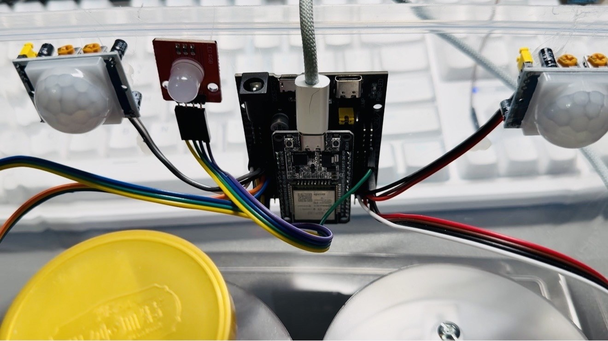

# ESP32 智能药盒

> **教学原型 / 历史项目。不是医疗器械，不用于诊断、治疗、紧急呼叫、服药判定或替代人工照护。**

基于 ESP32、两个 PIR、两个 HX711、蜂鸣器、RGB LED 与 Flutter 客户端的局域网智能药盒原型。它演示了：双药仓的人体接近与重量变化状态机、定时提醒、SPIFFS 本地记录、AP 配网与 Flutter 端的用药计划/记录界面。

## 项目照片与资料

这里整理了项目照片、界面截图和相关资料；文件处理说明见 [MEDIA_EVIDENCE](docs/MEDIA_EVIDENCE.md)。




## 当前状态与证据边界

| 层级 | 当前事实 |
| :-- | :-- |
| 源码来源 | 桌面目录与ZIP 已逐文件比对；仅 Android 网络权限/明文 HTTP 声明是桌面版本的后续整理差异。 |
| 固件 | ESP32 PlatformIO 干净构建已验证。 |
| Flutter 客户端 | `flutter test`、`flutter analyze`（`No issues found!`）与 `flutter build web --release` 已验证。 |
| 当前真机复测 | **未执行。** 当前提交尚未重新烧录、配网或联调 ESP32、PIR、HX711、RGB、蜂鸣器、SPIFFS、NTP 与 Flutter App。 |
| 实物与 EDA | 当前没有公开实物照片、演示视频、原理图、PCB、Gerber 或制造文件。 |

因此，本仓库只证明**源码来源已确认、硬件无关源码契约与构建通过**；不证明当前硬件在线、提醒已送达、重量准确、服药已经完成、网络安全或长期稳定。

## 功能概览（源码层）

```text
Flutter App ── HTTP（局域网）── ESP32 固件
                                  ├─ PIR × 2：接近/动作输入
                                  ├─ HX711 × 2：重量变化输入
                                  ├─ RGB + 蜂鸣器：提醒输出
                                  ├─ SPIFFS：计划、记录与配置
                                  └─ Wi-Fi：AP 配网 / STA 本地 REST
```

### 双药仓行为状态机

固件以 PIR 与 HX711 读数的组合区分以下**原型事件**：

- `take_ok`：拿起并放回后，重量变化超过源码阈值；
- `take_and_return`：拿起后原样放回；
- `open_no_take`：PIR 触发后未观察到足够重量变化；
- `weight_without_motion`：无 PIR 时出现的重量突变；
- `missed_dose`：提醒后，在固定时间窗内没有观察到 PIR 动作。

这些只是当前代码的启发式状态机，阈值、传感器漂移、安装位置、网络和设备故障都可能产生误报或漏报。**绝不能把任何事件写成医疗或真实服药结论。**

## 仓库结构

```text
firmware/                  ESP32 PlatformIO + Arduino 固件
app/                       Flutter 客户端（Android/iOS/Linux/macOS/Web/Windows scaffold）
hardware/BOM.csv           器件与接口清单
hardware/wiring-diagram.svg 源码推导接线边界图
docs/                      来源、协议、状态、验证与 Hardware Lab 卡片
scripts/                   公开仓敏感信息/结构检查与一键验证
.github/workflows/         GitHub Actions 构建门禁
```

## 源码接口与硬件边界

| 信号 | 当前源码接口 | 说明 |
| :-- | :-- | :-- |
| 蜂鸣器 | GPIO18 | 由 LEDC 驱动；仅适用于低功率、正确驱动的器件。 |
| RGB | R=GPIO13、G=GPIO21、B=GPIO22 | 默认共阳低电平点亮；共阴模块需调整构建标志。 |
| PIR × 2 | GPIO15、GPIO25 | 药仓 2 使用 `INPUT_PULLDOWN`。 |
| HX711 × 2 | `DT/SCK = 4/2` 与 `33/32` | 当前阈值仅为原型代码参数，不是剂量标定。 |
| 可选 SSD1306 | SDA=GPIO26、SCL=GPIO27 | 有实现文件，但本提交 `main.cpp` 没有调用显示初始化/刷新。 |

完整限制见 [HARDWARE.md](HARDWARE.md)。请先确认模块电压、供电、共地、限流、量程与真实板型；不要把 5 V 直接接入 ESP32 GPIO，也不要直接驱动继电器、电机、市电或大功率负载。

## 网络与数据安全

### AP 配网

没有已保存的 Wi-Fi 配置或 STA 连接失败时，固件进入 AP 模式：

```text
SSID: SmartPillbox
Password: none (open AP)
Config URL: http://192.168.4.1/
```

这是公开教学配置，并非安全凭据。AP 与 REST 都是**无认证、无 TLS 的 HTTP**，只能在隔离、可信的本地测试网络中使用，绝不能暴露到公网。

### STA REST

设备成功加入 Wi-Fi 后，WebServer 在端口 `80` 提供本地 HTTP 接口。App 默认地址 `http://192.168.4.1` 只用于进入配网起点；此地址不是已连接 STA 设备的保证。完成配网后，必须在 App 中手动填写设备实际获得的 STA IP。

当前接口包括：

| 方法 | 路径 | 当前源码行为 |
| :-- | :-- | :-- |
| `GET` | `/status` | 当前运行时间、IP、PIR 与提醒标志。 |
| `GET` / `POST` | `/plan` | 读取/写入计划 JSON。 |
| `GET` / `POST` | `/records` | 读取/追加事件记录；支持 `offset` / `limit` 分页。 |
| `GET` / `POST` | `/config` | 读取/写入配置；POST 中的 Wi-Fi 字段会写入设备本地 Preferences。 |
| `POST` | `/remind` | 触发一次源码中的提醒队列。 |
| `POST` | `/restart` | 返回成功后重启设备。 |

固件对未知路径在 AP 模式重定向到配网页，在 STA 模式返回 JSON `404`。CORS 为 `Access-Control-Allow-Origin: *`。接口请求成功不等于设备当前健康、提醒实际完成或服药行为真实发生。

App 中的**本次状态请求成功**只表示配置地址对 `GET /status` 给出了可解析的本地响应；它不表示远端服务在线、传感器通过、提醒送达或服药完成。

> **敏感数据提醒：** 不要调用 `GET /config` 后公开响应，也不要在 Issue、日志、截图、视频或 Git 中泄露 Wi-Fi SSID、密码、私网 IP、个人服药记录或其他健康/身份信息。

## 构建

### ESP32 固件

```bash
cd firmware
pio run
```

已验证环境：PlatformIO Core `6.1.19`、`espressif32@6.13.0`、`esp32dev`。最近一次隔离构建结果为 RAM `46588 / 327680`（14.2%）和 Flash `896141 / 1310720`（68.4%）。构建成功不等于适配你的开发板或外设。

### Flutter 客户端

```bash
cd app
flutter pub get
flutter test
flutter analyze
flutter build web --release
```

已验证环境：Flutter `3.41.2`、Dart `3.11.0`。最近一次隔离门禁中，Flutter `analyze` 返回 `No issues found!`。不要将 Web 构建视作 Android/iOS 真机、网络连接或硬件联调验证。

### 一键门禁

```bash
bash scripts/verify.sh
```

该脚本会在临时目录运行敏感信息/结构检查、Python 源码契约、PlatformIO 构建和 Flutter 测试/分析/Web 构建；不会烧录硬件、连接真实 Wi-Fi、调用真实设备、写入本机项目源目录或替你验证用药行为。

## 真机复测前必须完成

请按 [docs/VERIFICATION.md](docs/VERIFICATION.md) 记录日期与完整 Git commit，并至少逐项核对：

1. 精确 ESP32 开发板、Flash、USB 芯片和供电；
2. 两个 PIR、两个 HX711/称重结构、RGB、蜂鸣器和可选 OLED 的型号、供电与共地；
3. 当前提交的烧录、SPIFFS、AP/STA、NTP、HTTP 404、CORS 与错误路径；
4. 计划、记录、提醒、双药仓状态机的通过/失败/未测结果；
5. Flutter App 的实际地址配置、超时、错误态和端到端行为；
6. 30–60 分钟受控运行，记录重启、Wi-Fi、记录存储、传感器漂移和提醒行为；
7. 实物照片、视频与日志的 EXIF/GPS、SSID、密码、私网拓扑和个人数据脱敏。

在此之前，请保持“当前端到端真机复测未执行”的状态表述。

## 许可证、第三方与学习使用

- 本仓库中 Rongyi 原创固件、Flutter 客户端与文档以 [MIT License](LICENSE) 公开；
- 第三方依赖和框架见 [THIRD_PARTY_NOTICES.md](THIRD_PARTY_NOTICES.md)；
- 本项目适用于阅读、学习、实验和二次开发参考；请不要将代码、文档或演示直接包装为个人课程设计、毕业设计、竞赛或医疗产品成果；
- 复用时请保留来源说明，并自行承担硬件、电气、网络、数据与适用性验证责任。

## 更多证据与索引

- [项目状态](docs/PROJECT_STATUS.md)
- [来源裁决](docs/SOURCE_PROVENANCE.md)
- [协议说明](docs/PROTOCOL.md)
- [验证说明](docs/VERIFICATION.md)
- [Hardware Lab 索引卡片](docs/HARDWARE_LAB_CARD.md)
- [Hardware Lab](https://github.com/rongyishuaige7/hardware-lab)
